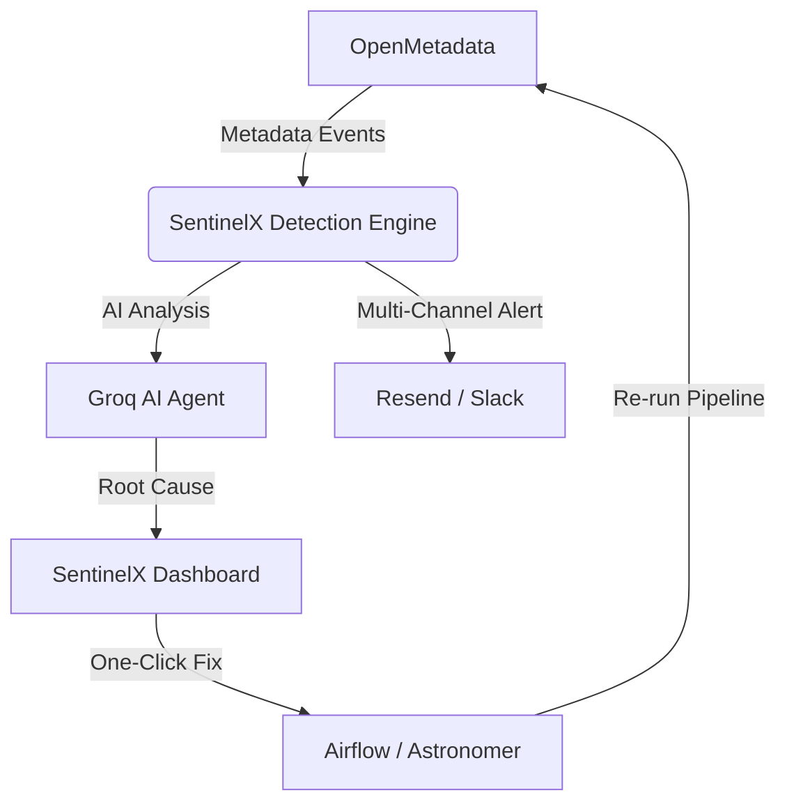

# 🛡️ SentinelX: Autonomous Data Reliability Engine

> **Eliminating Data Downtime with AI-Driven Detection, RCA, and Self-Healing.**

[](https://drive.google.com/file/d/1zTKIaCkUtCgRroeRu0ImeFZ4AD12bpOS/view?usp=sharing)

---

## 🌟 Overview
SentinelX is a state-of-the-art **Data Reliability Platform** designed to solve the "Silent Data Failure" problem. Unlike traditional monitoring that just alerts, SentinelX **autonomously detects**, **diagnoses (RCA)**, and **remediates** data incidents by closing the loop between Metadata, Orchestration, and AI.

### 🚀 Key Features
*   **Live Metadata Observability**: Deep integration with **OpenMetadata** to monitor Data Quality (DQ), Ownership, and Freshness.
*   **AI-Powered Root Cause Analysis**: Leverages **Groq-accelerated LLMs** to analyze lineage data and pinpoint exactly where a failure started.
*   **Autonomous Remediation**: One-click "Self-Healing" that triggers **Airflow/Astronomer** DAGs to re-run and fix tainted datasets.
*   **Lineage & Blast Radius**: Interactive visualization of downstream impact, preventing bad data from hitting executive dashboards.
*   **Enterprise Alerting**: Robust notification engine supporting **Resend (Email)** and **Slack Webhooks** with real-time dispatch logs.

---

## 🛠️ Technical Stack

### **Frontend**
- **Framework**: React 18 (Vite)
- **Styling**: Tailwind CSS / Vanilla CSS
- **Visualization**: React Flow (Lineage Graphs)
- **Icons**: Lucide React
- **State/API**: Axios + React Context

### **Backend**
- **Runtime**: Node.js + TypeScript
- **Database**: PostgreSQL (Hosted on Neon.tech)
- **ORM**: Prisma
- **Communication**: Socket.io (Real-time updates)
- **Orchestration**: Airflow REST API (Astronomer)

---

## 🏗️ Architecture



---

## 🚦 Getting Started

### 1. Prerequisites
- Node.js (v18+)
- PostgreSQL Instance
- OpenMetadata Instance (v1.2+)

### 2. Environment Setup
Create a `.env` file in the `/backend` directory:
```env
DATABASE_URL="your_postgres_url"
OPEN_METADATA_URL="http://your-om-server:8585/api/v1"
OPEN_METADATA_TOKEN="your_jwt_token"
AIRFLOW_URL="your_astronomer_url"
AIRFLOW_API_TOKEN="your_astro_token"
SMTP_HOST="smtp.resend.com"
SMTP_PASS="your_resend_key"
GROQ_API_KEY="your_groq_key"
```

### 3. Installation
```bash
# Install dependencies
npm install

# Database sync
npx prisma generate
npx prisma db push

# Start Backend
cd backend && npm run dev

# Start Frontend
cd frontend && npm run dev
```

---

## 🎥 Video Demonstration
Check out the full walkthrough of SentinelX in action, showing real-time detection and autonomous healing:

[**Watch SentinelX Demo on Google Drive**](https://drive.google.com/file/d/1zTKIaCkUtCgRroeRu0ImeFZ4AD12bpOS/view?usp=sharing)

---

## ⚖️ License
Distributed under the MIT License. See `LICENSE` for more information.

Developed with ❤️ for the 2024 Data Hackathon.
